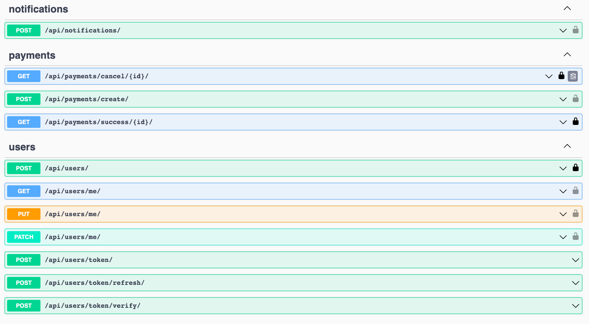

# Library service API

---
This Django REST framework-based API serves as a RESTful interface for a library service.

## How to run

---
```python
git clone https://github.com/megah1t/Library_service.git
cd Library_service
python -m venv venv
source venv/bin/activate # for linux or macOS
venv\Scripts\activate # for Windows
pip install -r requirements.txt
python manage.py migrate
python manage.py runserver
```
## Enviroment

---
You need to create a .env file and fill it in as in the example:
```
SECRET_KEY=<your SECRET_KEY>
TELEGRAM_BOT_TOKEN=<your TELEGRAM_BOT_TOKEN>
STRIPE_PUBLISHABLE_KEY=<your STRIPE_PUBLISHABLE_KEY>
STRIPE_SECRET_KEY=<your STRIPE_SECRET_KEY>

```

## Features

---
* Authentication: Implement a secure method of accessing API endpoints by utilizing JWT token-based authentication.

* Implemented CRUD functionality for Books.
* Implemented CRUD for Users Service.
* Implemented Borrowing list and detail.
* Filtering for the Borrowings List.
* Implemented return Borrowing functionality.
* Implemented the sending notifications in Telegram bot on each Borrowing creation.
* Implemented a daily-based function for checking borrowings overdue (Celery). ***
* Implemented Stripe Payment Session.
* Implemented FINE Payment for book overdue.
* API documentation: Utilize Swagger UI to automatically generate interactive API documentation, which facilitates developers in effortlessly exploring and testing the API's endpoints.

## API Endpoints

---
The following endpoints are available:

#### User Registration, Authentication and Following:
* api/user/register: Register a new user by providing an email and password.
* api/user/token: Receive a token
* api/user/token/refresh/: Refresh a token
* api/user/token/verify/: Verify a token
* api/user/me/: User information

---
 
* api/doc/swagger/: Documentations using Swagger





*** To run a periodic task (tracking debtors) in the terminal, enter the command(should be running docker):

1-st terminal
```
docker run -d -p 6379:6379 redis
celery -A Library_service worker -l INFO
```

2-nd terminal
```
celery -A Library_service beat -l INFO --scheduler django_celery_beat.schedulers:DatabaseScheduler
```


